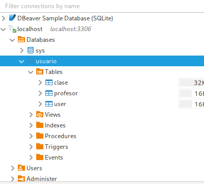

# API crud that manage users, teachers and class

Fast-api-usuario is a back api for manage user, teachers and class

## Installation

Crear la maquina virtual de mysql
    podman run --name podman-mysql -p 3306:3306 -e      MYSQL_ROOT_PASSWORD=root -d docker.io/mysql:latest

Crear entorno virtual
    sudo apt install python3.12-venv

    python3 -m venv venv
    source venv/bin/activate
    deactivate

Instalar dependencias
    pip install -r requirements.txt

Crear las tablas
    * Crear basedatos usuario
    * Crear usuario usuarioadmin con privilegios de administrador sobre la base de datos usuario

    python3
    >> from app.v1.scripts.create_tables import create_tables
    >> create_tables() 

